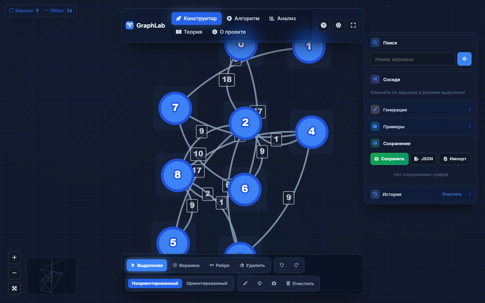
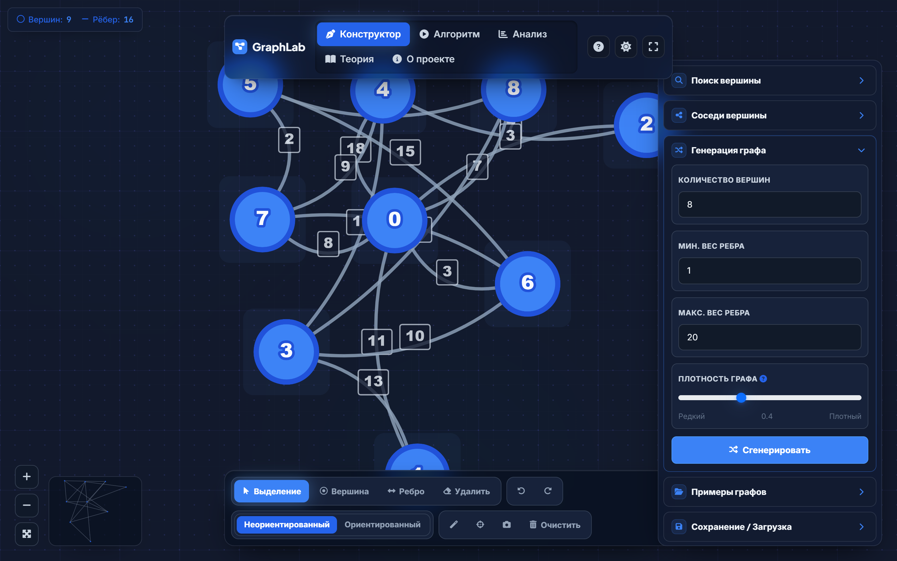
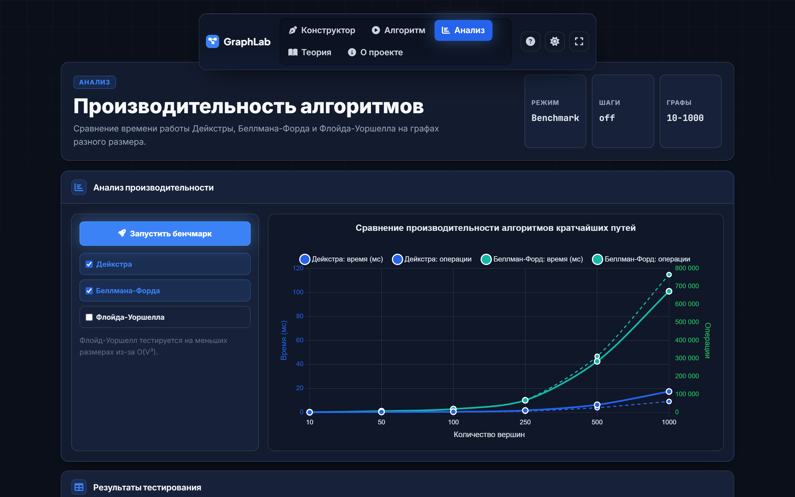

<div align="center">

<a name="readme-top"></a>



# 🗺️ Pathfinding Visualizer

<p align="center">
  <strong>Interactive Educational Tool for Graph Algorithms</strong>
</p>

<p align="center">
  <a href="#english">English</a> • <a href="#русский">Русский</a>
</p>

<p align="center">
  <a href="#"></a>
  <a href="#"></a>
  <a href="#"></a>
  <a href="https://github.com/nimalekyt-bit/dijkstra-visualizer/stargazers"></a>
</p>

*Watch Dijkstra, Bellman-Ford, and Floyd-Warshall algorithms execute node-by-node in real-time.*

</div>

<br/>

<details>
<summary><kbd>Table of contents</kbd></summary>

- [🇬🇧 English](#-english)
  - [✨ Features](#-features)
  - [👋🏻 Getting Started](#-getting-started)
- [🇷🇺 Русский](#-русский)
  - [✨ Возможности](#-возможности)
  - [👋🏻 С чего начать](#-с-чего-начать)

</details>

<br/>

## 📸 Gallery <a id="gallery"></a>

<p align="center">
  
  
</p>
<p align="center">
  
  
</p>

## 🇬🇧 English <a id="english"></a>

> [!NOTE]
> **Star Us!** If you enjoy this visualizer, please consider giving it a ⭐️!

Graph algorithms can be abstract and hard to grasp. **Pathfinding Visualizer** bridges the gap by letting you draw graphs interactively and watch shortest-path algorithms execute step-by-step. Built with a clean architecture, the core logic is strictly decoupled from the UI layer.

### ✨ Features

| Feature | Description |
| :--- | :--- |
| 🏗️ **Interactive Canvas** | Click and drag to create nodes and directed/undirected edges with weights. |
| 🔍 **Step-by-Step UI** | Pause, rewind, or fast-forward through the algorithm's decision-making. |
| 📊 **Real-time Analytics** | Distance tables update live; path reconstruction and state history. |
| 🚀 **Performance Testing** | Generate large random graphs to compare time complexity of different algorithms. |
| 💾 **100% Offline & Save** | Saves graphs to `LocalStorage`, works entirely offline, exports to JSON/PDF. |

### 👋🏻 Getting Started

No build steps required. Just clone and open!

```bash
git clone https://github.com/nimalekyt-bit/dijkstra-visualizer.git
cd dijkstra-visualizer

# Open index.html in your browser!
start index.html
```

*(For the best experience, you can also serve the folder locally using `npx serve .`)*

<p align="right"><a href="#readme-top">⤴️ Back to Top</a></p>

---

## 🇷🇺 Русский <a id="русский"></a>

> [!NOTE]
> **Поддержите проект!** Если визуализатор оказался полезным, поставьте ⭐️ репозиторию.

**Pathfinding Visualizer** — это веб-приложение, которое позволяет рисовать графы и наблюдать за работой алгоритмов поиска кратчайшего пути (Дейкстра, Беллман-Форд, Флойд-Уоршелл) в реальном времени.

### ✨ Возможности

| Фича | Описание |
| :--- | :--- |
| 🏗️ **Визуальный редактор** | Создавайте узлы и ребра в пару кликов. Поддерживаются отрицательные веса. |
| 🔍 **Пошаговая работа** | Наблюдайте, как алгоритм проверяет вершины и обновляет таблицу расстояний. |
| 📊 **Аналитика и отчеты** | Графики производительности и экспорт результатов в PDF/PNG. |
| 💾 **Работа оффлайн** | Не требует интернета (библиотеки скачаны локально) и сохраняет графы. |

### 👋🏻 С чего начать

Проект написан на чистом JS/HTML/CSS. Сборка не требуется.

```bash
git clone https://github.com/nimalekyt-bit/dijkstra-visualizer.git
cd dijkstra-visualizer

# Просто откройте index.html!
start index.html
```

<p align="right"><a href="#readme-top">⤴️ Back to Top</a></p>
